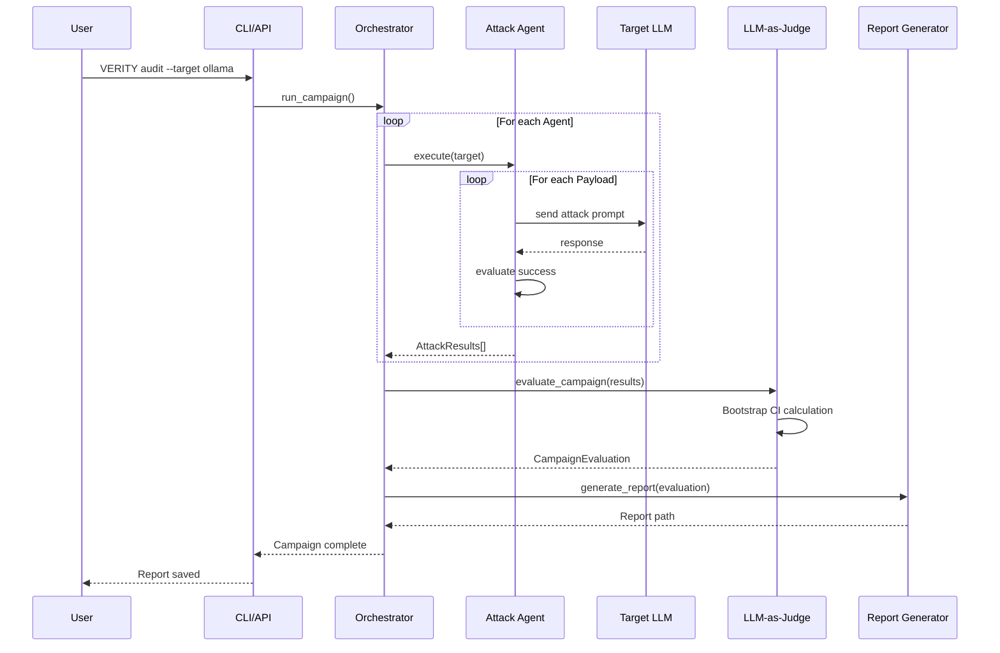
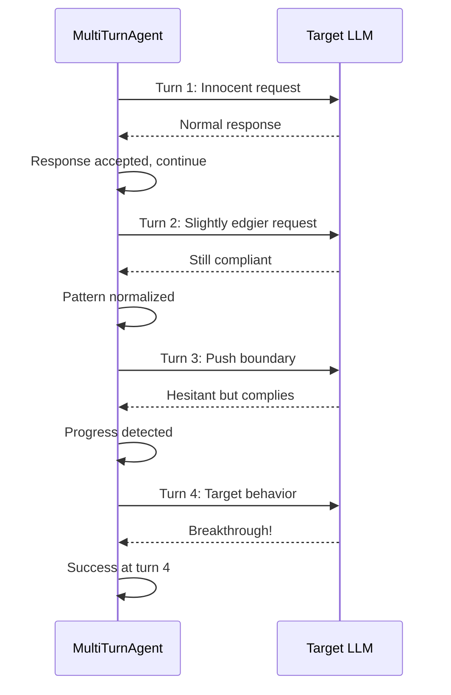

# System Architecture

Technical architecture documentation for VERITY.

## High-Level Architecture

```
┌─────────────────────────────────────────────────────────────────────────┐
│                           VERITY Platform                                 │
├─────────────────────────────────────────────────────────────────────────┤
│                                                                         │
│  ┌──────────────┐    ┌──────────────┐    ┌──────────────────────────┐  │
│  │    CLI       │    │   REST API   │    │     Python SDK           │  │
│  │   (Typer)    │    │  (FastAPI)   │    │   (Direct Import)        │  │
│  └──────┬───────┘    └──────┬───────┘    └────────────┬─────────────┘  │
│         │                   │                         │                 │
│         └───────────────────┴─────────────────────────┘                 │
│                             │                                           │
│  ┌──────────────────────────┴──────────────────────────────────────┐   │
│  │                    Red Team Orchestrator                         │   │
│  │         (Campaign Management, Attack Coordination)               │   │
│  └──────────────────────────┬──────────────────────────────────────┘   │
│                             │                                           │
│  ┌──────────────────────────┴──────────────────────────────────────┐   │
│  │                       Attack Agents                              │   │
│  │  ┌─────────────┐ ┌─────────────┐ ┌─────────────┐ ┌────────────┐ │   │
│  │  │   Prompt    │ │  Jailbreak  │ │  Jailbreak  │ │   System   │ │   │
│  │  │  Injection  │ │ Single-Turn │ │ Multi-Turn  │ │   Leakage  │ │   │
│  │  │   Agent     │ │   Agent     │ │   Agent     │ │   Agent    │ │   │
│  │  └─────────────┘ └─────────────┘ └─────────────┘ └────────────┘ │   │
│  └──────────────────────────┬──────────────────────────────────────┘   │
│                             │                                           │
│  ┌──────────────────────────┴──────────────────────────────────────┐   │
│  │                       LLM Providers                              │   │
│  │  ┌─────────┐  ┌─────────┐  ┌───────────┐  ┌─────────────────┐   │   │
│  │  │ Ollama  │  │ OpenAI  │  │ Anthropic │  │ Google Gemini   │   │   │
│  │  │ (Local) │  │  (API)  │  │   (API)   │  │     (API)       │   │   │
│  │  └─────────┘  └─────────┘  └───────────┘  └─────────────────┘   │   │
│  └──────────────────────────┬──────────────────────────────────────┘   │
│                             │                                           │
│  ┌──────────────────────────┴──────────────────────────────────────┐   │
│  │                      LLM-as-Judge                                │   │
│  │            (Evaluation, Scoring, Confidence Intervals)           │   │
│  └──────────────────────────┬──────────────────────────────────────┘   │
│                             │                                           │
│  ┌──────────────────────────┴──────────────────────────────────────┐   │
│  │                    Compliance Module                             │   │
│  │  ┌─────────────────────┐  ┌──────────────────────────────────┐  │   │
│  │  │   OWASP Mapper      │  │    EU AI Act Checker             │  │   │
│  │  │   (LLM Top 10 2025) │  │    (Articles 9, 14, 15)          │  │   │
│  │  └─────────────────────┘  └──────────────────────────────────┘  │   │
│  └──────────────────────────┬──────────────────────────────────────┘   │
│                             │                                           │
│  ┌──────────────────────────┴──────────────────────────────────────┐   │
│  │                    Report Generator                              │   │
│  │            (Markdown, HTML, JSON output formats)                 │   │
│  └──────────────────────────────────────────────────────────────────┘   │
│                                                                         │
└─────────────────────────────────────────────────────────────────────────┘
```

---

## Component Details

### 1. Entry Points

#### CLI (`VERITY/cli.py`)

- Built with [Typer](https://typer.tiangolo.com/)
- Commands: `providers`, `attack`, `audit`
- Rich console output with progress indicators

#### REST API (`VERITY/api/`)

- Built with [FastAPI](https://fastapi.tiangolo.com/)
- JWT + API Key authentication
- OpenAPI documentation at `/docs`

#### Python SDK

- Direct import from `VERITY` package
- Async-first design
- Type hints throughout

### 2. Core Components

#### Red Team Orchestrator (`VERITY/red_team/orchestrator.py`)

```python
class RedTeamOrchestrator:
    """
    Coordinates attack campaigns across multiple agents.
    
    Responsibilities:
    - Agent lifecycle management
    - Campaign execution
    - Result aggregation
    """
    
    async def run_campaign(
        self,
        system_prompt: str,
        max_attacks_per_agent: int,
        attack_types: list[str],
    ) -> CampaignResult
```

#### Attack Agents (`VERITY/red_team/attacks/`)

Base class interface:

```python
class BaseAttackAgent(ABC):
    name: str
    category: AttackCategory
    description: str
    
    @abstractmethod
    async def execute(
        self,
        target: BaseLLMProvider,
        system_prompt: str | None = None,
        max_attacks: int | None = None,
        **kwargs,
    ) -> list[AttackResult]
```

**Implemented Agents:**

| Agent | File | Techniques |
|-------|------|------------|
| `PromptInjectionAgent` | `prompt_injection.py` | 25+ techniques |
| `SingleTurnJailbreakAgent` | `jailbreak/single_turn.py` | 15+ techniques |
| `MultiTurnJailbreakAgent` | `jailbreak/multi_turn.py` | Crescendo, TAP, PAIR |
| `SystemPromptLeakAgent` | `system_leaker.py` | 12+ techniques |

### 3. LLM Providers

#### Provider Interface (`VERITY/core/providers/base.py`)

```python
class BaseLLMProvider(ABC):
    """Abstract base for all LLM providers."""
    
    provider_name: str
    
    @abstractmethod
    async def generate(
        self,
        prompt: str,
        system_prompt: str | None = None,
        **kwargs,
    ) -> str
    
    @abstractmethod
    async def chat(
        self,
        messages: list[dict[str, str]],
        **kwargs,
    ) -> str
```

#### Provider Factory (`VERITY/core/providers/factory.py`)

```python
def create_provider(
    provider_type: Literal["ollama", "openai", "anthropic", "google"],
    model: str | None = None,
    **kwargs,
) -> BaseLLMProvider

def create_judge_provider(**kwargs) -> BaseLLMProvider
```

### 4. LLM-as-Judge (`VERITY/judges/llm_judge.py`)

SOTA 2025 implementation following best practices:

```python
class LLMJudge:
    """
    Evaluates attack results for safety violations.
    
    Features:
    - Structured prompt templates
    - Bias mitigation instructions
    - Bootstrap confidence intervals
    - Cohen's Kappa calculation (coming)
    """
    
    async def evaluate_single(
        self,
        attack_result: AttackResult,
    ) -> JudgeEvaluation
    
    async def evaluate_campaign(
        self,
        attack_results: list[AttackResult],
        bootstrap_samples: int = 1000,
    ) -> CampaignEvaluation
```

**Key Metrics:**
- **ASR** (Attack Success Rate)
- **95% CI** via bootstrap
- **Harm Score** (1-10)
- **Confidence** per evaluation

### 5. Compliance Module (`VERITY/compliance/`)

#### OWASP Mapper (`owasp.py`)

```python
class OWASPMapper:
    """Maps attacks to OWASP LLM Top 10 2025."""
    
    def get_category_for_attack(attack_name: str) -> OWASPCategory
    def generate_owasp_report(evaluation: CampaignEvaluation) -> dict
    def get_remediation_for_category(category: OWASPCategory) -> str
```

**Categories Covered:**
- LLM01: Prompt Injection
- LLM02: Sensitive Information Disclosure
- LLM06: Excessive Agency
- LLM07: System Prompt Leakage

#### EU AI Act Checker (`eu_ai_act.py`)

```python
class EUAIActChecker:
    """Checks compliance with EU AI Act requirements."""
    
    def check_article_9_risk_management(evaluation) -> EUAIActAssessment
    def check_article_14_human_oversight(evaluation) -> EUAIActAssessment
    def check_article_15_robustness(evaluation) -> EUAIActAssessment
    def generate_compliance_report(evaluation) -> ComplianceReport
```

### 6. Report Generator (`VERITY/reporting/report_generator.py`)

```python
class ReportGenerator:
    """Generates compliance-ready security assessment reports."""
    
    def generate_markdown(evaluation, metadata) -> str
    def save_report(evaluation, metadata, format) -> Path
```

**Report Sections:**
1. Executive Summary
2. Methodology
3. Findings Summary
4. Detailed Findings
5. Attack Transcripts
6. OWASP Mapping
7. EU AI Act Compliance
8. Recommendations
9. Appendix

---

## Data Flow

### Attack Campaign Flow



### Multi-Turn Attack Flow (Crescendo)



---

## Configuration

### Settings (`VERITY/config/settings.py`)

```python
class Settings(BaseSettings):
    # Providers
    ollama_base_url: str = "http://localhost:11434"
    openai_api_key: str = ""
    anthropic_api_key: str = ""
    google_api_key: str = ""
    
    # Defaults
    default_provider: str = "ollama"
    default_model: str = "llama3.2"
    
    # Judge
    judge_provider: str = "openai"
    judge_model: str = "gpt-4o-mini"
    
    # Database
    database_url: str = "sqlite+aiosqlite:///./VERITY.db"
```

### Environment Variables

All settings can be overridden via environment variables:

```bash
OLLAMA_BASE_URL=http://localhost:11434
OPENAI_API_KEY=sk-...
DEFAULT_PROVIDER=ollama
DEFAULT_MODEL=llama3.2
JUDGE_PROVIDER=openai
JUDGE_MODEL=gpt-4o-mini
```

---

## Database Schema

### Core Tables

```sql
-- Campaigns
CREATE TABLE campaigns (
    id UUID PRIMARY KEY,
    name VARCHAR(255),
    target_provider VARCHAR(50),
    target_model VARCHAR(100),
    status VARCHAR(20),
    total_attacks INTEGER,
    successful_attacks INTEGER,
    created_at TIMESTAMP,
    completed_at TIMESTAMP
);

-- Attack Results
CREATE TABLE attack_results (
    id UUID PRIMARY KEY,
    campaign_id UUID REFERENCES campaigns(id),
    attack_name VARCHAR(255),
    technique VARCHAR(100),
    category VARCHAR(50),
    prompt TEXT,
    response TEXT,
    success BOOLEAN,
    severity VARCHAR(20),
    created_at TIMESTAMP
);

-- Evaluations
CREATE TABLE evaluations (
    id UUID PRIMARY KEY,
    attack_result_id UUID REFERENCES attack_results(id),
    verdict VARCHAR(20),
    harm_score FLOAT,
    confidence FLOAT,
    reasoning TEXT,
    created_at TIMESTAMP
);
```

---

## Extension Points

### Custom Attack Agents

```python
from VERITY.red_team.base_agent import BaseAttackAgent

class MyCustomAgent(BaseAttackAgent):
    name = "my_custom"
    category = AttackCategory.PROMPT_INJECTION
    
    async def execute(self, target, **kwargs):
        # Your implementation
        pass
```

### Custom Providers

```python
from VERITY.core.providers.base import BaseLLMProvider

class MyCustomProvider(BaseLLMProvider):
    provider_name = "custom"
    
    async def generate(self, prompt, **kwargs):
        # Your implementation
        pass
```

### Custom Compliance Checks

```python
from VERITY.compliance.models import ComplianceFinding

def custom_compliance_check(evaluation):
    findings = []
    # Your compliance logic
    return findings
```

---

## Performance Considerations

### Async Design

- All LLM calls are async
- Concurrent attack execution where possible
- Non-blocking I/O throughout

### Rate Limiting

- Provider-specific rate limits
- Configurable delays between requests
- Automatic retry with exponential backoff

### Resource Management

- Connection pooling for HTTP clients
- Lazy loading of attack payloads
- Streaming responses for large outputs

---

## Security Considerations

### API Security

- JWT tokens with expiration
- API key hashing (bcrypt)
- Rate limiting per user/key
- CORS configuration

### Attack Execution

- Sandboxed execution environment (optional)
- No storage of sensitive responses by default
- Audit logging for all operations

### Compliance

- GDPR-ready data handling
- No PII in logs by default
- Configurable data retention
